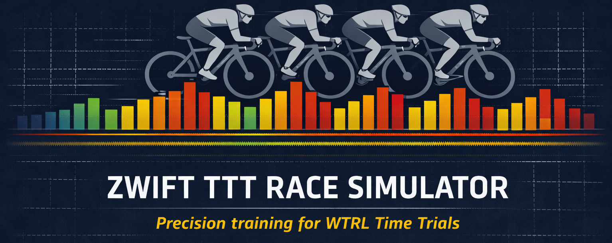
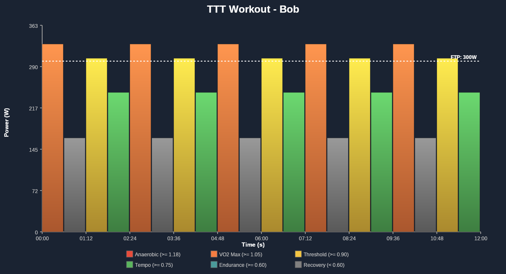

# Zwift TTT race simulator

A workout generator for **Team Time Trial (TTT)** racing on Zwift (both ZRL and WTRL), designed to help coaches and teams **rehearse race strategy** and **experience realistic race dynamics** in ERG mode.

While races are held on Zwift, the generated workouts can be used on **any cycling platform** that supports ERG-controlled trainers.

📖 **[View the full documentation on our website](https://simonech.github.io/zwift-ttt-race-simulator/)**

---

## This is still a work in progress

## 🚴 Motivation

Team Time Trial racing is not just about FTP — it’s about:

- Pull duration and rotation order
- Drafting dynamics
- Smooth transitions
- Managing fatigue over time
- Surviving climbs as a team

Most existing tools focus on **optimizing a race plan**, but there is a gap between *having a plan* and *knowing if your riders can execute it*.

This project aims to close that gap by allowing teams to **simulate their race as a structured workout**, so riders can:

- Feel the real effort of the planned rotations
- Identify weak points before race day
- Fine-tune pacing and pull durations
- Train specifically for upcoming events


## 🎯 Goals

- Simulate a Zwift TTT race using a deterministic rotation model
- Generate **one workout per rider**, reflecting their exact role in the rotation
- Allow riders to train the race effort in ERG mode
- Provide a foundation for future race simulation and coaching insights


## 🧠 Core Concepts

### Rotation-based simulation

- Riders rotate through lead, draft, and last-wheel positions
- Each rider has:
  - A pull duration
  - A power target per position (1st, 2nd, 3rd, 4th+)
- When a rider finishes their pull:
  - They rotate to the back
  - Other riders move up one position
- The pull leader defines the duration of the block for all riders

This creates a realistic, repeatable simulation of a TTT paceline.


## 🏗️ Architecture

The simulator uses a layered architecture with clear separation of concerns:

**CSV Input** → **CsvParser** → **PacelinePlanComposer** → **WorkoutProjector** → **ZwoExporter** / **ImageExporter**

### Key Components

- **Model Layer** (`ZwiftTTTSim.Core/Model/`): Domain models
  - `PacelinePlan`: Complete race plan with all pulls and total duration
  - `Pull`: One complete rotation cycle
  - `PacelinePosition`: A rider's state within a pull
  - `RiderPowerPlan`: Rider data with pull duration and position-based power values
  - `WorkoutStep`: Duration + power pair for export

- **Services Layer** (`ZwiftTTTSim.Core/Services/`): Business logic
  - `PacelinePlanComposer`: Orchestrates rotation sequence and generates the complete race plan
  - `WorkoutProjector`: Transforms race plans into rider-specific workout steps
  - `CsvParser`: Parses rider input CSV files

- **Exporters Layer** (`ZwiftTTTSim.Core/Exporters/`): Output generation
  - `ZwoExporter`: Generates Zwift-compatible XML workout files
  - `ImageExporter`: Creates PNG visualizations of power profiles
  - `ConsoleBarVisualizer`: Renders ASCII power profiles in the console

### Design Pattern: Hierarchical Rotation Model

**One Pull = One Complete Rotation Cycle**

Each `Pull` represents all riders in their current positions, with power values determined by position. When a rider finishes their pull, they rotate to the back and other riders move up one position. The pulling rider's pull duration defines the block duration for all riders.

Key insights:
- Position-based power is determined by `RiderPowerPlan.GetPowerByPosition()`
- Power values beyond position 4 use the 4th position value (position clamping)
- The `WorkoutProjector` transforms `PacelinePlan` objects into per-rider `WorkoutStep` lists


## 📥 Inputs

The simulator expects rider data in CSV format with the following structure:

```csv
# RiderName, Weight, FTP, Pull Duration, Pull Power, 2nd place power, 3rd place power, Draft (4th and more)
Alice, 70, 300, 30, 350, 300, 280, 250
Bob, 75, 280, 45, 330, 290, 270, 240
Charlie, 72, 320, 60, 370, 320, 300, 270
```

Where:
- **RiderName**: Unique identifier for the rider
- **Weight**: Rider weight in kg (currently stored but not used in workout generation)
- **FTP**: Functional Threshold Power in watts (currently stored but not used in workout generation)
- **Pull Duration**: How long the rider pulls at the front, in seconds
- **Power Values**: Target power in watts for positions 1 (pulling), 2, 3, and 4+ (drafting)

A sample CSV file (`sample-riders.csv`) is included in the repository.

### CLI Usage

```bash
dotnet run --project ZwiftTTTSim.CLI -- --input <csv-file> [--output <folder>] [--rotations <count>] [--format <format>] [--verbose] [--quiet] [--dry-run] [--no-logo]
```

**Options:**
- `-i, --input <file>` (Required): Path to the CSV file containing rider data
- `-o, --output <folder>`: Output folder for workout files (default: `workouts`)
- `-r, --rotations <count>`: Number of rotations for the workout (default: `5`)
- `--format <format>`: Output file format(s): `zwo`, `image` (can specify multiple)
- `--verbose`: Enable verbose logging with detailed pipeline information
- `--quiet`: Enable quiet mode - only print workflow steps without details
- `--dry-run`: Perform a dry run without generating files
- `--no-logo`: Suppress the program logo display

**Examples:**
```bash
# Generate workouts with default settings (5 rotations, output to 'workouts' folder, export as ZWO)
dotnet run --project ZwiftTTTSim.CLI -- -i sample-riders.csv --format zwo

# Generate workouts with custom settings and visualizations
dotnet run --project ZwiftTTTSim.CLI -- -i my-team.csv -o output/race1 -r 10 --format zwo image

# Verbose output with detailed information
dotnet run --project ZwiftTTTSim.CLI -- -i sample-riders.csv --format zwo --verbose

# Dry run without generating files
dotnet run --project ZwiftTTTSim.CLI -- -i sample-riders.csv --dry-run

# Quiet mode with minimal output
dotnet run --project ZwiftTTTSim.CLI -- -i sample-riders.csv --format zwo image --quiet
```

In practice, the input data can be:
- Hand-crafted based on team strategy
- Generated by third-party Zwift TTT optimization tools
- Tuned by a coach based on rider feedback


## 📤 Outputs

- One structured workout per rider
- Exported as XML-based workout files (e.g. Zwift `.zwo` / WKO-compatible formats)
- Visual representation (PNG images) showing power profile over time with color-coded position indicators
- Workouts can be executed on:
  - Zwift
  - TrainerRoad
  - Wahoo SYSTM
  - Any platform supporting ERG mode workouts

### Example Workout Visualizations

**Alice's Workout** - Showcases Anaerobic, Tempo, Threshold and VO2Max zones:


**Bob's Workout** - Showcases Threshold, VO2 Max, Recovery, and Endurance zones:



The visualizations show:
- **X-axis**: Time (proportional to interval duration)
- **Y-axis**: Power output in watts
- **FTP Line**: White dotted horizontal line showing the rider's Functional Threshold Power
- **Color coding** (based on intensity relative to FTP): 
  - 🔴 Red: Anaerobic (≥ 1.18 × FTP)
  - 🟠 Orange: VO2 Max (≥ 1.05 × FTP)
  - 🟡 Yellow: Threshold (≥ 0.90 × FTP)
  - 🟢 Green: Tempo (≥ 0.75 × FTP)
  - 🔵 Blue: Endurance (≥ 0.60 × FTP)
  - ⚫ Gray: Recovery (< 0.60 × FTP)

---

## 🧪 Development approach

This project is developed using **Test-Driven Development (TDD)**:

- Rotation logic is covered by unit tests
- Example-based tests validate known TTT scenarios
- Future extensions are added without breaking existing behavior

This ensures the simulator remains predictable and safe to extend.

---

## 🛣️ Roadmap (planned features)

The current implementation focuses on **basic rotation simulation**. Planned enhancements include:

- 🕒 **Race duration–based pull estimation**  
  Automatically compute the number of pulls required to reach a target race time.

- 🚦 **Race start simulation**  
  Initial effort block simulating the start from the gate before drafting is effective.

- 🔄 **Transition dynamics**  
  Model ease-off and re-acceleration when dropping from lead to last position.

- ⛰️ **Climb-aware pacing**  
  Support w/kg-based pacing sections to better simulate climbs where absolute power pacing breaks down.

- 📊 **Effort and fatigue analysis**  
  Estimate which riders are likely to struggle and where.

- 🧠 **Coaching insights**  
  Identify limiting riders and suggest rotation or pacing adjustments.

---

## 👥 Target audience

- Zwift TTT coaches
- Competitive TTT teams (ZRL, WTRL, private leagues)
- Riders who want to better understand their role in a team effort
- Developers interested in cycling simulation tools

---

## 🔧 Technical Notes

### System.CommandLine Version

⚠️ **Important:** This project uses `System.CommandLine` version `2.0.0-beta4.22272.1`

While this is a beta version, it is intentionally pinned for stability reasons:
- Beta5 and later versions introduced breaking API changes
- Later "stable" releases (2.0.2+) continue to have API instability  
- Beta4 has proven to be more stable and well-tested than subsequent releases

See [dotnet/command-line-api#2576](https://github.com/dotnet/command-line-api/issues/2576) for context on the discontinuity between beta4 and beta5.

**Do not upgrade** without thorough testing. When `System.CommandLine` releases a true stable 3.0 version, consider upgrading after validation.

---

## ⚠️ Disclaimer

This tool is **not affiliated with Zwift**.
Zwift is a registered trademark of Zwift, Inc.

The simulator aims to approximate race dynamics for training and planning purposes and does not guarantee identical in-game results.

---

## 📄 License

This project is licensed under the MIT License – see the [LICENSE](LICENSE) file for details.
