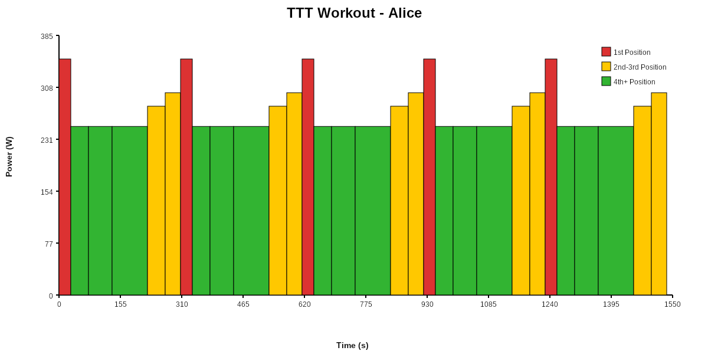

# Zwift TTT race simulator

A workout generator for **Team Time Trial (TTT)** racing on Zwift (both ZRL and WTRL), designed to help coaches and teams **rehearse race strategy** and **experience realistic race dynamics** in ERG mode.

While races are held on Zwift, the generated workouts can be used on **any cycling platform** that supports ERG-controlled trainers.

---

## This is still a work in progress

## 🚴 Motivation

Team Time Trial racing is not just about FTP — it’s about:

- Pull duration and rotation order
- Drafting dynamics
- Smooth transitions
- Managing fatigue over time
- Surviving climbs as a team

Most existing tools focus on **optimizing a race plan**, but there is a gap between *having a plan* and *knowing if your riders can execute it*.

This project aims to close that gap by allowing teams to **simulate their race as a structured workout**, so riders can:

- Feel the real effort of the planned rotations
- Identify weak points before race day
- Fine-tune pacing and pull durations
- Train specifically for upcoming events


## 🎯 Goals

- Simulate a Zwift TTT race using a deterministic rotation model
- Generate **one workout per rider**, reflecting their exact role in the rotation
- Allow riders to train the race effort in ERG mode
- Provide a foundation for future race simulation and coaching insights


## 🧠 Core Concepts

### Rotation-based simulation

- Riders rotate through lead, draft, and last-wheel positions
- Each rider has:
  - A pull duration
  - A power target per position (1st, 2nd, 3rd, 4th+)
- When a rider finishes their pull:
  - They rotate to the back
  - Other riders move up one position
- The pull leader defines the duration of the block for all riders

This creates a realistic, repeatable simulation of a TTT paceline.


## 📥 Inputs

The simulator expects rider data in CSV format with the following structure:

```csv
# RiderName, Weight, FTP, PullDuration, PowerByPosition[0], PowerByPosition[1], PowerByPosition[2], PowerByPosition[3]
Alice, 70, 300, 30, 350, 300, 280, 250
Bob, 75, 280, 45, 330, 290, 270, 240
Charlie, 72, 320, 60, 370, 320, 300, 270
```

Where:
- **RiderName**: Unique identifier for the rider
- **Weight**: Rider weight in kg (currently stored but not used in workout generation)
- **FTP**: Functional Threshold Power in watts (currently stored but not used in workout generation)
- **PullDuration**: How long the rider pulls at the front, in seconds
- **PowerByPosition[0-3]**: Target power in watts for positions 1 (pulling), 2, 3, and 4+ (drafting)

A sample CSV file (`sample-riders.csv`) is included in the repository.

### CLI Usage

```bash
dotnet run --project ZwiftTTTSim.CLI -- --input <csv-file> [--output <folder>] [--rotations <count>]
```

**Options:**
- `-i, --input <file>` (Required): Path to the CSV file containing rider data
- `-o, --output <folder>`: Output folder for workout files (default: `workouts`)
- `-r, --rotations <count>`: Number of rotations for the workout (default: `5`)

**Example:**
```bash
# Generate workouts with default settings (5 rotations, output to 'workouts' folder)
dotnet run --project ZwiftTTTSim.CLI -- -i sample-riders.csv

# Generate workouts with custom settings
dotnet run --project ZwiftTTTSim.CLI -- -i my-team.csv -o output/race1 -r 10
```

In practice, the input data can be:
- Hand-crafted based on team strategy
- Generated by third-party Zwift TTT optimization tools
- Tuned by a coach based on rider feedback


## 📤 Outputs

- One structured workout per rider
- Exported as XML-based workout files (e.g. Zwift `.zwo` / WKO-compatible formats)
- Visual representation (PNG images) showing power profile over time with color-coded position indicators
- Workouts can be executed on:
  - Zwift
  - TrainerRoad
  - Wahoo SYSTM
  - Any platform supporting ERG mode workouts

### Example Workout Visualization



The visualization shows:
- **X-axis**: Time (proportional to interval duration)
- **Y-axis**: Power output in watts
- **Color coding**: 
  - 🔴 Red: 1st position (pulling hard)
  - 🟡 Yellow: 2nd-3rd position (moderate effort)
  - 🟢 Green: 4th+ position (drafting)

---

## 🧪 Development approach

This project is developed using **Test-Driven Development (TDD)**:

- Rotation logic is covered by unit tests
- Example-based tests validate known TTT scenarios
- Future extensions are added without breaking existing behavior

This ensures the simulator remains predictable and safe to extend.

---

## 🛣️ Roadmap (planned features)

The current implementation focuses on **basic rotation simulation**. Planned enhancements include:

- 🕒 **Race duration–based pull estimation**  
  Automatically compute the number of pulls required to reach a target race time.

- 🚦 **Race start simulation**  
  Initial effort block simulating the start from the gate before drafting is effective.

- 🔄 **Transition dynamics**  
  Model ease-off and re-acceleration when dropping from lead to last position.

- ⛰️ **Climb-aware pacing**  
  Support w/kg-based pacing sections to better simulate climbs where absolute power pacing breaks down.

- 📊 **Effort and fatigue analysis**  
  Estimate which riders are likely to struggle and where.

- 🧠 **Coaching insights**  
  Identify limiting riders and suggest rotation or pacing adjustments.

---

## 👥 Target audience

- Zwift TTT coaches
- Competitive TTT teams (ZRL, WTRL, private leagues)
- Riders who want to better understand their role in a team effort
- Developers interested in cycling simulation tools

---

## ⚠️ Disclaimer

This tool is **not affiliated with Zwift**.
Zwift is a registered trademark of Zwift, Inc.

The simulator aims to approximate race dynamics for training and planning purposes and does not guarantee identical in-game results.

---

## 📄 License

This project is licensed under the MIT License – see the [LICENSE](LICENSE) file for details.
