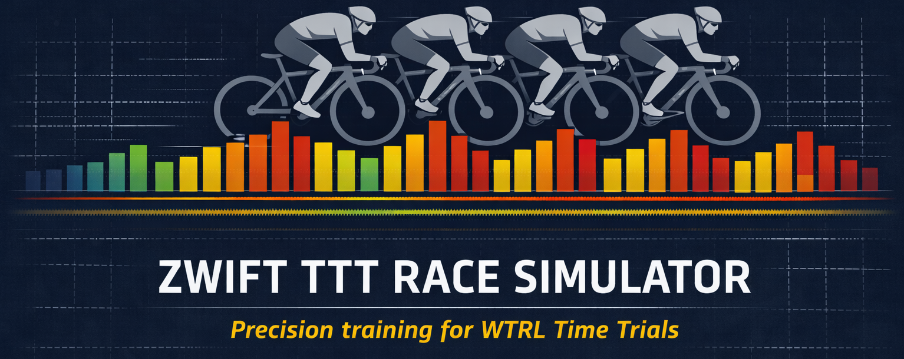
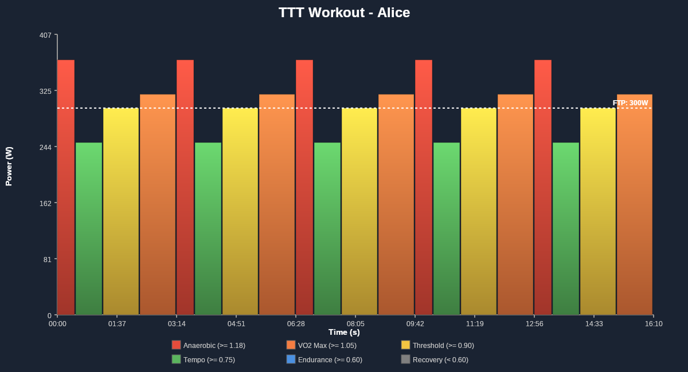

# 🚴 Zwift TTT Race Simulator

> Generate structured workouts from a Team Time Trial (TTT) rotation plan to rehearse races in ERG mode.

📖 Full documentation: https://simonech.github.io/zwift-ttt-race-simulator/

---

## 🎯 What is this?

This tool converts a **TTT race plan** into **one workout per rider**, allowing teams to train and validate their strategy before race day.

It is designed for:
- Zwift Racing League (ZRL)
- WTRL TTT events
- Any team-based time trial training

While races happen on Zwift, workouts can be used on **any ERG-compatible platform**.

---

## ⚙️ How it works

- Riders rotate through positions (pull → last → draft)
- Each rider defines:
  - Pull duration
  - Target power per position (1st, 2nd, 3rd, 4th+)
- The leader determines the duration of each block
- The system generates **individual workouts** reflecting the full rotation

---

## 📥 Input (CSV)

Example:

```
# RiderName, Weight, FTP, PullDuration, P1, P2, P3, P4+
Alice, 70, 300, 30, 350, 300, 280, 250
Bob, 75, 280, 45, 330, 290, 270, 240
Charlie, 72, 320, 60, 370, 320, 300, 270
```

- **RiderName**: Unique identifier for the rider
- **Weight**: Rider weight in kg
- **FTP**: Functional Threshold Power in watts
- **Pull Duration**: How long the rider pulls at the front, in seconds
- **Power Values**: Target power in watts for positions 1 (pulling), 2, 3, and 4+ (drafting)

> ℹ️ FTP is used for intensity calculation and visualization (not for rotation logic)

---

## 🚀 CLI Usage

```
dotnet run --project ZwiftTTTSim.CLI -- --input <csv-file> [options]
```

### Options

- `-i, --input <file>` (required)  
- `-o, --output <folder>` (default: `workouts`)  
- `-r, --rotations <count>` (default: `5`)  
- `--format <zwo|image>` (can combine)  
- `--verbose` / `--quiet`  
- `--dry-run`  
- `--no-logo`

### Examples

```
# Basic usage
dotnet run --project ZwiftTTTSim.CLI -- -i sample-riders.csv --format zwo

# Generate workouts + images
dotnet run --project ZwiftTTTSim.CLI -- -i team.csv -r 10 --format zwo image

# Dry run
dotnet run --project ZwiftTTTSim.CLI -- -i team.csv --dry-run
```

---

## 📤 Output

- `.zwo` workout files (Zwift-compatible)
- `.png` visualizations of power over time

Each rider receives a **personalized workout** based on their position during the rotation.

### Example Workout Visualizations

**Alice's Workout** - Showcases Anaerobic, Tempo, Threshold and VO2Max zones:



---

## 🏗️ Development

```
dotnet build
dotnet test
dotnet run --project ZwiftTTTSim.CLI -- -i sample-riders.csv
```

---

## 🚧 Project Status

This project is currently a personal side project and the architecture is still evolving.

For now, large feature pull requests (especially roadmap implementations) are not being accepted.

Feel free to open issues or discussions if you’d like to contribute or suggest ideas.

See [CONTRIBUTING](CONTRIBUTING.md) for more details

---

## ⚠️ Notes

- Uses `System.CommandLine` (beta version pinned for stability)
- Input validation is strict (CSV must match expected format)

---

## 📄 License

MIT License – see [LICENSE](LICENSE)

---

## ⚠️ Disclaimer

This project is not affiliated with Zwift.  
Zwift is a registered trademark of Zwift, Inc.

The simulator approximates race dynamics and does not guarantee identical in-game results.
